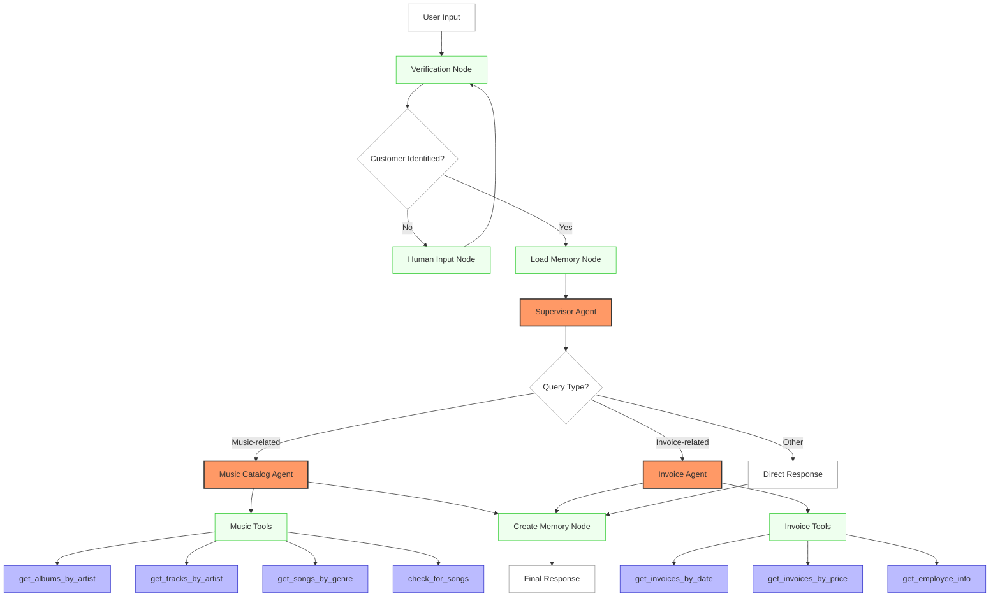

# 🤖 AI Agent System with Django

This project integrates a LangGraph-based multi-agent system into a Django application. The system uses local LLMs (via Ollama, GPT4All, or llama.cpp) to provide a customer support experience for a digital music store.

## 🏗️ Multi-Agent System Architecture

This document outlines the architecture of the multi-agent system implemented in this Django application. The system uses LangChain and LangGraph to create a network of specialized AI agents that work together to respond to user queries.

### 🔍 System Overview

The multi-agent system follows a hierarchical architecture with a supervisor agent orchestrating specialized sub-agents. Each agent is responsible for a specific domain of knowledge or functionality.

```
┌───────────────────┐
│                   │
│  Supervisor Agent │
│                   │
└─────────┬─────────┘
          │
          │ Routes requests
          │
┌─────────▼─────────┬───────────────────┐
│                   │                   │
│  Music Catalog    │    Invoice        │
│  Agent            │    Agent          │
│                   │                   │
└───────────────────┴───────────────────┘
```

### 📊 System Flow Diagram



## 🤖 Agent Components

### 1. **🧠 Supervisor Agent**
- Acts as the central coordinator
- Routes user queries to the appropriate specialized agent
- Handles fallback responses when specialized agents fail
- Manages conversation flow using keyword-based routing

### 2. **🎵 Music Catalog Agent**
- Processes music-related queries
- Searches for artists, albums, songs, and genres
- Integrates with the Chinook music database
- **Tools Available:**
  - `get_albums_by_artist`: Retrieve albums by a specific artist
  - `get_tracks_by_artist`: Get tracks by an artist
  - `get_songs_by_genre`: Find songs by genre
  - `check_for_songs`: Verify song existence

### 3. **📊 Invoice Agent**
- Handles invoice and purchase-related queries
- Retrieves customer invoice information
- Provides order history and payment details
- **Tools Available:**
  - `get_invoices_by_customer_sorted_by_date`: Get customer invoices sorted by date
  - `get_invoices_sorted_by_unit_price`: Get invoices sorted by price
  - `get_employee_by_invoice_and_customer`: Get employee info for invoices

## 🔑 Key System Functions

### 🔐 Verification and Customer Identification
The system includes a verification node that identifies customers based on their provided information (customer ID, email, or phone). This ensures that the appropriate customer data is retrieved for secure access.

### 💾 Memory Management
The system maintains a persistent memory of user preferences and past interactions:
- **`load_memory_node`**: Retrieves stored user preferences at the start of each conversation
- **`create_memory_node`**: Updates user preferences based on the current conversation
- **Data stored**: Music preferences, customer information, interaction history

### 🛡️ Error Handling
The system includes robust error handling mechanisms:
- Fallback responses when LLM calls fail (such as 404 errors with Ollama)
- Automatic retries with simplified approaches
- Graceful degradation to maintain conversation flow
- Detailed error tracking in conversation metadata
- Keyword-based fallbacks when AI agents are unavailable

### 🔄 Agent Routing Logic
The supervisor uses a keyword-based routing system to direct queries to the appropriate specialized agent:
- **Music-related terms** ("song", "artist", "album", "genre", "track") → Music Catalog Agent
- **Invoice-related terms** ("invoice", "purchase", "order", "payment", "billing") → Invoice Agent
- **Default routing** when no clear match is found → Direct supervisor response

## 📝 Implementation Details

### 🔄 LangGraph State Flow
The system is implemented as a LangGraph with the following workflow:

1. **User Input**: User enters their query through the web interface
2. **Verification**: System identifies the customer using provided credentials
3. **Memory Loading**: Loads user preferences and conversation history
4. **Supervisor Routing**: Routes the query to the appropriate specialized agent
5. **Agent Processing**: Specialized agent processes the query using its tools
6. **Memory Update**: Updates user preferences based on the conversation
7. **Response**: Returns the final response to the user

### 🛠️ Error Handling Strategy

The system implements multiple layers of error handling:

1. **LLM Failure Handling**: If Ollama LLM calls fail (404 errors), the system uses keyword-based fallbacks
2. **Agent Failure Handling**: If specialized agents fail, the supervisor provides a direct response
3. **Complete Failure Handling**: If all else fails, a generic error message is returned with suggestions
4. **Network Issues**: Graceful handling of network connectivity problems
5. **Database Errors**: Fallback responses when database queries fail

## 🧰 Technology Stack

- **🦜 LangChain**: Framework for building LLM applications
- **📊 LangGraph**: Library for creating agent workflows and graphs
- **🚀 Ollama**: Local LLM provider (with fallbacks for API errors)
- **🔋 GPT4All**: Alternative local LLM provider
- **⚡ llama.cpp**: High-performance LLM inference
- **🗄️ SQLite**: Database backend for storing data and conversations
- **🎯 Django**: Web framework for the application
- **🌐 Django REST Framework**: API development
- **🎨 Bootstrap**: Frontend styling

## 💬 Chat History and Agent Tracking

The system records detailed information about each conversation, including:
- **Agent Identification**: Which agent handled each message (with visual badges in the UI)
- **Timestamps**: Precise timing of each interaction
- **Status Tracking**: Success/failure status of responses
- **Conversation Branching**: Support for conversation continuations and branching
- **Metadata Storage**: Detailed conversation metadata for analysis

This information is stored in the conversation metadata and can be viewed in both the Django admin interface and the user interface.

### 🧠 Conversation Management Features
Users can:
- 📝 **Edit conversation titles**: Customize conversation names
- 🔄 **Continue conversations**: Resume from specific points in the conversation
- 🗑️ **Clear conversation history**: Remove messages while keeping the conversation
- ❌ **Delete entire conversations**: Complete conversation removal
- 🔍 **Agent visibility**: See which agent handled each message
- 📊 **Conversation analytics**: View conversation statistics and performance

## ✨ Features

- **🧠 Multi-Agent Architecture**: Specialized agents for music catalog and invoice information
- **🏠 Local LLM Support**: Uses Ollama, GPT4All, or llama.cpp for offline AI processing
- **🧩 Long-Term Memory**: Remembers user preferences across conversations
- **👤 Human-in-the-Loop**: Verifies customer identity before providing sensitive information
- **🌐 Django Integration**: Full REST API and web interface
- **🗄️ Database Integration**: Works with the Chinook sample database for music store data
- **🔄 State Management**: LangGraph-powered state transitions and agent coordination
- **🔒 Secure Processing**: All AI processing happens locally on your machine
- **📱 Responsive Design**: Mobile-friendly interface
- **🎨 Modern UI**: Clean, intuitive user interface with real-time updates

## 🛠️ Requirements

### System Requirements
- **Python**: 3.9 or higher
- **Django**: 5.2 or higher
- **RAM**: 8GB+ recommended for running local LLMs
- **Storage**: 5GB+ for model files
- **OS**: Windows, macOS, or Linux

### Local LLM Requirements
- **Ollama**: Recommended for ease of use
- **GPT4All**: Alternative for lower resource usage
- **llama.cpp**: For maximum performance

### Database
- **SQLite**: Included with Python (no additional installation required)

## 📦 Installation

### 1. Clone the Repository
```bash
git clone https://github.com/cyberwithaman/agents.git
cd agents
```

### 2. Create Virtual Environment
```bash
python -m venv venv
source venv/bin/activate  # On Windows: venv\Scripts\activate
```

### 3. Install Dependencies
```bash
pip install -r requirements.txt
```

### 4. Install Ollama (Recommended)
- Visit [Ollama's website](https://ollama.ai/) for installation instructions
- For macOS: `brew install ollama`
- For Linux: `curl -fsSL https://ollama.ai/install.sh | sh`
- For Windows: Download from the official website

### 5. Pull LLM Models
```bash
ollama pull llama2
ollama pull llama3  # Optional, for better performance
```

### 6. Database Setup
```bash
python manage.py makemigrations
python manage.py migrate
```

### 7. Initialize Sample Data
```bash
python manage.py init_db
```

### 8. Create Superuser
```bash
python manage.py createsuperuser
```

### 9. Start the Development Server
```bash
python manage.py runserver
```

### 10. Access the Application
- **Web Interface**: http://localhost:8000/
- **Admin Interface**: http://localhost:8000/admin/
- **API Documentation**: http://localhost:8000/api/

## ⚙️ Configuration

### 🤖 LLM Configuration

Configure different LLM models through the Django admin interface:

1. **Access Admin**: Navigate to http://localhost:8000/admin/
2. **Login**: Use your superuser credentials
3. **Configure Models**: Go to "LLM Models" section
4. **Add Model**: Create new model configurations
5. **Set Active**: Check the "Is active" checkbox for your preferred model

### Available LLM Providers

#### 🚀 Ollama (Recommended)
- **Pros**: Fast, easy to use, automatic model management
- **Cons**: Requires separate installation
- **Best for**: General use, development, production

#### 🔋 GPT4All
- **Pros**: Self-contained, lower resource requirements
- **Cons**: Slower than Ollama
- **Best for**: Resource-constrained environments

#### ⚡ llama.cpp
- **Pros**: Maximum performance, fine-grained control
- **Cons**: Requires manual model file management
- **Best for**: Production environments, custom models

### Model Configuration Parameters

```python
# Example LLM Configuration
{
    "model_name": "llama2",
    "base_url": "http://localhost:11434",
    "temperature": 0.7,
    "max_tokens": 2048,
    "timeout": 30,
    "stream": False
}
```

## 🎮 Usage

### 🌐 Web Interface

#### Getting Started
1. **Login**: Access the web interface at http://localhost:8000/
2. **Authentication**: Login with your credentials
3. **New Conversation**: Click "New Conversation" to start
4. **Customer Verification**: Provide customer ID, email, or phone number
5. **Ask Questions**: Query about music catalog or invoice information
6. **View History**: See conversation history with agent badges

#### Interface Features
- **Real-time Chat**: Instant responses with typing indicators
- **Agent Badges**: Visual indicators showing which agent handled each message
- **Conversation Management**: Edit, delete, or continue conversations
- **Search**: Find specific conversations or messages
- **Export**: Download conversation history

### 🔌 REST API

The system provides a comprehensive REST API for integration:

#### Conversation Management
```bash
# List all conversations
GET /api/conversations/

# Get conversation details
GET /api/conversations/{id}/

# Create a new conversation
POST /api/conversations/
{
    "title": "Music Questions",
    "user": 1
}

# Update conversation title
PATCH /api/conversations/{id}/
{
    "title": "Updated Title"
}

# Delete conversation
DELETE /api/conversations/{id}/

# Clear conversation history
DELETE /api/conversations/{id}/clear_history/

# Continue from specific message
POST /api/conversations/{id}/continue_from_message/
{
    "message_id": 123
}
```

#### Chat Operations
```bash
# Send a new message
POST /api/chat/
{
    "message": "What albums does The Beatles have?",
    "thread_id": "conv_123",
    "customer_id": "1"
}

# Resume interrupted conversation
POST /api/chat/{thread_id}/resume/
{
    "last_message_id": 456
}
```

#### System Information
```bash
# Get system status
GET /api/system-info/

# Bulk delete users (admin only)
POST /api/users/bulk_delete/
{
    "user_ids": [1, 2, 3]
}
```

### 🛠️ Admin Interface Features

The Django admin interface provides powerful management capabilities:

#### User Management
- **Bulk Operations**: Delete multiple users while preserving superusers
- **Advanced Filtering**: Filter by staff status, superuser status, and activity
- **Search Functionality**: Search by username, email, or full name
- **Activity Tracking**: Monitor user login and activity patterns

#### Conversation Management
- **Agent Tracking**: View which agents handled each message
- **Advanced Filtering**: Filter by date range, user, or agent type
- **Content Search**: Search within conversation content
- **Performance Metrics**: View response times and success rates

#### System Configuration
- **LLM Model Management**: Configure and activate different AI models
- **Agent Configuration**: Customize agent prompts and behavior
- **Tool Management**: Enable/disable specific agent tools
- **Performance Monitoring**: Track system resource usage

## 🏗️ Architecture Deep Dive

### Component Architecture

```
┌────────────────────────────────────────────────────────────────┐
│                    Django Web Framework                        │
├────────────────────────────────────────────────────────────────┤
│  ┌─────────────────┐  ┌─────────────────┐  ┌─────────────────┐ │
│  │   Web Views     │  │   REST API      │  │   Admin Panel   │ │
│  └─────────────────┘  └─────────────────┘  └─────────────────┘ │
├────────────────────────────────────────────────────────────────┤
│                    LangGraph Agent System                      │
│  ┌─────────────────┐  ┌─────────────────┐  ┌─────────────────┐ │
│  │   Supervisor    │  │   Music Agent   │  │  Invoice Agent  │ │
│  │     Agent       │  │                 │  │                 │ │
│  └─────────────────┘  └─────────────────┘  └─────────────────┘ │
├────────────────────────────────────────────────────────────────┤
│                    Tool & Memory Layer                         │
│  ┌─────────────────┐  ┌─────────────────┐  ┌─────────────────┐ │
│  │   Database      │  │   Memory        │  │   LLM           │ │
│  │   Tools         │  │   Management    │  │   Integration   │ │
│  └─────────────────┘  └─────────────────┘  └─────────────────┘ │
├────────────────────────────────────────────────────────────────┤
│                    Data & Storage Layer                        │
│  ┌─────────────────┐  ┌─────────────────┐  ┌─────────────────┐ │
│  │   SQLite        │  │   Chinook       │  │   Conversation  │ │
│  │   Database      │  │   Database      │  │   Storage       │ │
│  └─────────────────┘  └─────────────────┘  └─────────────────┘ │
└────────────────────────────────────────────────────────────────┘
```

### 🔄 Agent Workflow Detail

1. **Input Processing**
   - User message received via web interface or API
   - Message validation and sanitization
   - Session management and authentication

2. **Customer Verification**
   - Human-in-the-loop verification process
   - Customer identification via ID, email, or phone
   - Security checks and access control

3. **Memory Management**
   - Load existing user preferences from database
   - Context retrieval from conversation history
   - Preference aggregation and preparation

4. **Agent Routing**
   - Keyword analysis and intent detection
   - Route determination based on query content
   - Agent selection and initialization

5. **Query Processing**
   - Specialized agent processes the query
   - Tool execution and data retrieval
   - Response generation and formatting

6. **Memory Updates**
   - Extract new preferences from conversation
   - Update user preference database
   - Conversation state persistence

7. **Response Delivery**
   - Format response for delivery
   - Add metadata and agent information
   - Return to user interface

## 🔧 Customization Guide

### 🛠️ Adding New Tools

#### Step 1: Define Tool Function
```python
# agentsapp/utils.py
def get_artist_biography(artist_name: str) -> str:
    """Get biographical information about an artist."""
    # Implementation here
    pass
```

#### Step 2: Register Tool with Agent
```python
# agentsapp/agent_builder.py
from .utils import get_artist_biography

music_tools = [
    get_albums_by_artist,
    get_tracks_by_artist,
    get_songs_by_genre,
    check_for_songs,
    get_artist_biography,  # Add new tool
]
```

#### Step 3: Configure in Admin
1. Navigate to Django admin
2. Add tool to "Available Tools" section
3. Assign tool to appropriate agent

### 📝 Customizing Agent Prompts

#### Via Admin Interface
1. Go to Django admin → "Agent Types"
2. Select the agent you want to modify
3. Edit the prompt template
4. Save changes

#### Via Code
```python
# agentsapp/agent_builder.py
MUSIC_AGENT_PROMPT = """
You are a music expert assistant. Your role is to help customers
find information about artists, albums, songs, and genres.

Available tools:
- get_albums_by_artist: Find albums by a specific artist
- get_tracks_by_artist: Get tracks by an artist
- get_songs_by_genre: Find songs by genre
- check_for_songs: Verify if specific songs exist

Always provide helpful, accurate information about music.
"""
```

### 🤖 Adding New Agents

#### Step 1: Create Agent Tools
```python
# agentsapp/utils.py
def get_concert_info(artist_name: str) -> str:
    """Get upcoming concert information."""
    # Implementation
    pass

def get_ticket_prices(venue: str) -> str:
    """Get ticket pricing information."""
    # Implementation
    pass
```

#### Step 2: Define Agent Builder
```python
# agentsapp/agent_builder.py
def create_concert_agent(llm, tools, system_prompt):
    """Create the concert information agent."""
    prompt = ChatPromptTemplate.from_messages([
        ("system", system_prompt),
        ("placeholder", "{messages}"),
    ])
    
    agent = prompt | llm.bind_tools(tools)
    return agent
```

#### Step 3: Update Supervisor Routing
```python
# agentsapp/agent_builder.py
def route_query(state):
    """Route user queries to appropriate agents."""
    messages = state['messages']
    last_message = messages[-1].content.lower()
    
    # Add new routing logic
    if any(keyword in last_message for keyword in ['concert', 'show', 'tour', 'venue']):
        return 'concert_agent'
    elif any(keyword in last_message for keyword in ['song', 'album', 'artist']):
        return 'music_agent'
    elif any(keyword in last_message for keyword in ['invoice', 'purchase', 'order']):
        return 'invoice_agent'
    else:
        return 'supervisor'
```

### 🎨 Frontend Customization

#### Styling
The frontend uses Bootstrap for styling. You can customize:
- Colors and themes in `static/css/style.css`
- Layout components in templates
- JavaScript behavior in `static/js/chat.js`

#### Adding New Features
1. **Message Types**: Add support for different message types (images, files)
2. **Agent Visualization**: Create visual representations of agent workflows
3. **Analytics Dashboard**: Build user analytics and system performance dashboards

## 📊 Technical Implementation Details

### 🔄 LangGraph Components

#### StateGraph Configuration
```python
from langgraph.graph import StateGraph, END
from langgraph.checkpoint.sqlite import SqliteSaver

# Create the graph
workflow = StateGraph(AgentState)

# Add nodes
workflow.add_node("verification", verification_node)
workflow.add_node("load_memory", load_memory_node)
workflow.add_node("supervisor", supervisor_agent)
workflow.add_node("music_agent", music_agent)
workflow.add_node("invoice_agent", invoice_agent)
workflow.add_node("create_memory", create_memory_node)

# Add edges
workflow.add_edge("verification", "load_memory")
workflow.add_edge("load_memory", "supervisor")
workflow.add_conditional_edges("supervisor", route_query)
workflow.add_edge("music_agent", "create_memory")
workflow.add_edge("invoice_agent", "create_memory")
workflow.add_edge("create_memory", END)

# Set entry point
workflow.set_entry_point("verification")
```

#### State Management
```python
from typing import TypedDict, List, Optional
from langchain_core.messages import BaseMessage

class AgentState(TypedDict):
    messages: List[BaseMessage]
    customer_id: Optional[str]
    customer_info: Optional[dict]
    user_preferences: Optional[dict]
    agent_used: Optional[str]
    error_info: Optional[dict]
```

### 🛠️ Tool Implementation

#### Database Tool Example
```python
def get_albums_by_artist(artist_name: str) -> str:
    """Get albums by a specific artist from the database."""
    try:
        connection = sqlite3.connect('data/chinook.db')
        cursor = connection.cursor()
        
        query = """
        SELECT DISTINCT albums.Title
        FROM albums
        JOIN artists ON albums.ArtistId = artists.ArtistId
        WHERE artists.Name LIKE ?
        ORDER BY albums.Title
        """
        
        cursor.execute(query, (f'%{artist_name}%',))
        albums = cursor.fetchall()
        connection.close()
        
        if albums:
            album_list = [album[0] for album in albums]
            return f"Albums by {artist_name}: {', '.join(album_list)}"
        else:
            return f"No albums found for artist: {artist_name}"
            
    except Exception as e:
        return f"Error retrieving albums: {str(e)}"
```

### 🧠 Memory System Implementation

#### Preference Storage
```python
def save_user_preferences(customer_id: str, preferences: dict):
    """Save user preferences to database."""
    try:
        # Implementation for saving preferences
        # This could be database storage, file storage, etc.
        pass
    except Exception as e:
        logger.error(f"Error saving preferences: {e}")

def load_user_preferences(customer_id: str) -> dict:
    """Load user preferences from database."""
    try:
        # Implementation for loading preferences
        # Return default preferences if none found
        return {}
    except Exception as e:
        logger.error(f"Error loading preferences: {e}")
        return {}
```

## 🤖 Supported LLM Models

### Ollama Models
- **llama2**: General purpose, good balance of performance and resource usage
- **llama3**: Improved performance over llama2, requires more resources
- **mistral**: Fast and efficient, good for resource-constrained environments
- **codellama**: Specialized for code-related queries
- **dolphin-mistral**: Fine-tuned for conversational AI

### GPT4All Models
- **gpt4all-j**: Java-based implementation
- **ggml-gpt4all-l13b-snoozy**: Larger model for better performance
- **ggml-gpt4all-j-v1.3-groovy**: Optimized for conversational use

### Configuration Examples
```python
# Ollama Configuration
OLLAMA_CONFIG = {
    "model": "llama2",
    "base_url": "http://localhost:11434",
    "temperature": 0.7,
    "max_tokens": 2048
}

# GPT4All Configuration
GPT4ALL_CONFIG = {
    "model": "gpt4all-j",
    "device": "cpu",
    "temperature": 0.7,
    "max_tokens": 2048
}
```

## 🔧 Advanced Troubleshooting

### 🔌 LLM Connection Issues

#### Ollama Problems
```bash
# Check if Ollama is running
curl http://localhost:11434/api/tags

# Start Ollama service
ollama serve

# Check available models
ollama list

# Pull missing models
ollama pull llama2
```

#### GPT4All Issues
```bash
# Check GPT4All installation
python -c "import gpt4all; print(gpt4all.__version__)"

# Download models manually
python -c "from gpt4all import GPT4All; GPT4All('gpt4all-j')"
```

### 🗄️ Database Problems

#### SQLite Issues
```bash
# Check database integrity
sqlite3 db.sqlite3 "PRAGMA integrity_check;"

# Backup database
cp db.sqlite3 db.sqlite3.backup

# Reset database
python manage.py migrate --run-syncdb
```

#### Chinook Database Issues
```bash
# Download fresh copy
wget https://raw.githubusercontent.com/lerocha/chinook-database/master/ChinookDatabase/DataSources/Chinook_Sqlite.sqlite

# Move to data directory
mv Chinook_Sqlite.sqlite data/chinook.db
```

### 💾 Memory and Performance Issues

#### Out of Memory Errors
```python
# Reduce model parameters
OLLAMA_CONFIG = {
    "model": "llama2",
    "max_tokens": 1024,  # Reduced from 2048
    "temperature": 0.5,
    "context_window": 2048  # Reduced context
}
```

#### Slow Response Times
```bash
# Monitor system resources
htop

# Check model performance
ollama run llama2 "Hello world"

# Use smaller models
ollama pull tinyllama
```

## 🧪 Testing

### Running Tests
```bash
# Run all tests
python manage.py test

# Run specific test module
python manage.py test agentsapp.tests

# Run with coverage
pip install coverage
coverage run --source='.' manage.py test
coverage html
```

### Test Structure
```
agentsapp/
├── tests/
│   ├── __init__.py
│   ├── test_models.py
│   ├── test_views.py
│   ├── test_agents.py
│   └── test_utils.py
```

## 🚀 Deployment

### Production Setup
```bash
# Install production dependencies
pip install gunicorn whitenoise

# Collect static files
python manage.py collectstatic

# Run with Gunicorn
gunicorn agents.wsgi:application --bind 0.0.0.0:8000
```

### Docker Deployment
```dockerfile
FROM python:3.11-slim

WORKDIR /app
COPY requirements.txt .
RUN pip install -r requirements.txt

COPY . .
RUN python manage.py collectstatic --noinput

EXPOSE 8000
CMD ["gunicorn", "agents.wsgi:application", "--bind", "0.0.0.0:8000"]
```

## 📈 Performance Monitoring

### Metrics Collection
- Response time tracking
- Agent usage statistics
- Error rate monitoring
- Resource utilization tracking

### Logging Configuration
```python
LOGGING = {
    'version': 1,
    'disable_existing_loggers': False,
    'handlers': {
        'file': {
            'level': 'INFO',
            'class': 'logging.FileHandler',
            'filename': 'agents.log',
        },
    },
    'loggers': {
        'agentsapp': {
            'handlers': ['file'],
            'level': 'INFO',
            'propagate': True,
        },
    },
}
```

## 🔐 Security Considerations

### Authentication
- Django's built-in authentication system
- Session management
- CSRF protection

### Data Protection
- Customer data access control
- Secure database connections
- Local AI processing (no data sent to external APIs)
- Encrypted conversation storage
- Access logging and audit trails

### API Security
```python
# settings.py
REST_FRAMEWORK = {
    'DEFAULT_AUTHENTICATION_CLASSES': [
        'rest_framework.authentication.SessionAuthentication',
        'rest_framework.authentication.TokenAuthentication',
    ],
    'DEFAULT_PERMISSION_CLASSES': [
        'rest_framework.permissions.IsAuthenticated',
    ],
    'DEFAULT_THROTTLE_CLASSES': [
        'rest_framework.throttling.AnonRateThrottle',
        'rest_framework.throttling.UserRateThrottle'
    ],
    'DEFAULT_THROTTLE_RATES': {
        'anon': '100/hour',
        'user': '1000/hour'
    }
}
```

## 🎯 Best Practices

### Development Guidelines
1. **Code Organization**
   - Keep agent logic separate from Django views
   - Use type hints for better code documentation
   - Implement proper error handling at all levels
   - Follow Django naming conventions

2. **Database Management**
   - Use database transactions for critical operations
   - Implement proper indexing for performance
   - Regular database backups
   - Monitor database performance

3. **Agent Development**
   - Design agents with single responsibilities
   - Implement comprehensive error handling
   - Use structured prompts for consistency
   - Test agents with various input types

### Production Considerations
1. **Scalability**
   - Use Redis for session storage in production
   - Implement database connection pooling
   - Consider using PostgreSQL for larger deployments
   - Monitor resource usage and scale accordingly

2. **Reliability**
   - Implement health checks for all services
   - Use proper logging for debugging
   - Set up monitoring and alerting
   - Plan for disaster recovery

3. **Security**
   - Regular security audits
   - Keep dependencies updated
   - Use environment variables for sensitive data
   - Implement proper access controls

## 📚 API Reference

### Authentication Endpoints
```bash
# Login
POST /api/auth/login/
{
    "username": "user@example.com",
    "password": "password123"
}

# Logout
POST /api/auth/logout/

# Token refresh
POST /api/auth/token/refresh/
{
    "refresh": "refresh_token_here"
}
```

### Conversation Management
```bash
# List conversations with pagination
GET /api/conversations/?page=1&limit=10

# Search conversations
GET /api/conversations/?search=music&ordering=-created_at

# Get conversation with messages
GET /api/conversations/123/?include_messages=true

# Update conversation
PATCH /api/conversations/123/
{
    "title": "New Title",
    "is_archived": false
}
```

### Chat Operations
```bash
# Send message with streaming
POST /api/chat/
{
    "message": "What's the weather like?",
    "thread_id": "conv_123",
    "customer_id": "cust_456",
    "stream": true
}

# Get message history
GET /api/conversations/123/messages/?limit=50&offset=0

# React to message
POST /api/messages/456/react/
{
    "reaction": "thumbs_up"
}
```

### System Management
```bash
# Get system status
GET /api/system/status/

# Get available models
GET /api/system/models/

# Update model configuration
POST /api/system/models/configure/
{
    "model_id": "llama2",
    "active": true,
    "parameters": {
        "temperature": 0.7,
        "max_tokens": 2048
    }
}
```

## 🛠️ Development Tools

### Django Management Commands
```bash
# Initialize database with sample data
python manage.py init_db

# Clear all conversation data
python manage.py clear_conversations

# Export conversation data
python manage.py export_conversations --format=json

# Import conversation data
python manage.py import_conversations --file=conversations.json

# Test agent performance
python manage.py test_agents --agent=music_agent --queries=test_queries.txt

# Update model embeddings
python manage.py update_embeddings
```

### Development Scripts
```bash
# Start development environment
./scripts/dev_start.sh

# Run tests with coverage
./scripts/test_with_coverage.sh

# Deploy to production
./scripts/deploy.sh

# Backup production data
./scripts/backup_prod.sh
```

## 🔧 Configuration Files

### Environment Variables
```bash
# .env file
DEBUG=True
SECRET_KEY=your-secret-key-here
DATABASE_URL=sqlite:///db.sqlite3

# Ollama Configuration
OLLAMA_BASE_URL=http://localhost:11434
OLLAMA_MODEL=llama2
OLLAMA_TIMEOUT=30

# GPT4All Configuration
GPT4ALL_MODEL_PATH=/path/to/models
GPT4ALL_DEVICE=cpu

# Redis Configuration (for production)
REDIS_URL=redis://localhost:6379/0

# Email Configuration
EMAIL_BACKEND=django.core.mail.backends.smtp.EmailBackend
EMAIL_HOST=smtp.gmail.com
EMAIL_PORT=587
EMAIL_USE_TLS=True
EMAIL_HOST_USER=your-email@gmail.com
EMAIL_HOST_PASSWORD=your-app-password
```

### Production Settings
```python
# settings/production.py
import os
from .base import *

DEBUG = False
ALLOWED_HOSTS = ['yourdomain.com', 'www.yourdomain.com']

# Database
DATABASES = {
    'default': {
        'ENGINE': 'django.db.backends.postgresql',
        'NAME': os.getenv('DB_NAME'),
        'USER': os.getenv('DB_USER'),
        'PASSWORD': os.getenv('DB_PASSWORD'),
        'HOST': os.getenv('DB_HOST', 'localhost'),
        'PORT': os.getenv('DB_PORT', '5432'),
    }
}

# Redis Cache
CACHES = {
    'default': {
        'BACKEND': 'django_redis.cache.RedisCache',
        'LOCATION': os.getenv('REDIS_URL', 'redis://localhost:6379/0'),
        'OPTIONS': {
            'CLIENT_CLASS': 'django_redis.client.DefaultClient',
        }
    }
}

# Static files
STATIC_ROOT = os.path.join(BASE_DIR, 'staticfiles')
STATICFILES_STORAGE = 'whitenoise.storage.CompressedManifestStaticFilesStorage'
```

## 🎨 Frontend Components

### Chat Interface Structure
```html
<!-- templates/agentsapp/index.html -->
<div class="chat-container">
    <div class="chat-header">
        <h2>AI Music Store Assistant</h2>
        <div class="agent-status">
            <span class="status-indicator"></span>
            <span class="status-text">Ready</span>
        </div>
    </div>
    
    <div class="chat-messages" id="chatMessages">
        <!-- Messages will be populated here -->
    </div>
    
    <div class="chat-input">
        <input type="text" id="messageInput" placeholder="Ask about music or orders...">
        <button id="sendButton">Send</button>
    </div>
</div>
```

### JavaScript Chat Logic
```javascript
// static/js/chat.js
class ChatInterface {
    constructor() {
        this.messageInput = document.getElementById('messageInput');
        this.sendButton = document.getElementById('sendButton');
        this.chatMessages = document.getElementById('chatMessages');
        this.setupEventListeners();
    }
    
    setupEventListeners() {
        this.sendButton.addEventListener('click', () => this.sendMessage());
        this.messageInput.addEventListener('keypress', (e) => {
            if (e.key === 'Enter') this.sendMessage();
        });
    }
    
    async sendMessage() {
        const message = this.messageInput.value.trim();
        if (!message) return;
        
        this.addMessage(message, 'user');
        this.messageInput.value = '';
        
        try {
            const response = await this.callAPI(message);
            this.addMessage(response.message, 'assistant', response.agent);
        } catch (error) {
            this.addMessage('Sorry, I encountered an error. Please try again.', 'error');
        }
    }
    
    async callAPI(message) {
        const response = await fetch('/api/chat/', {
            method: 'POST',
            headers: {
                'Content-Type': 'application/json',
                'X-CSRFToken': this.getCSRFToken()
            },
            body: JSON.stringify({
                message: message,
                thread_id: this.threadId,
                customer_id: this.customerId
            })
        });
        
        return await response.json();
    }
    
    addMessage(content, sender, agent = null) {
        const messageDiv = document.createElement('div');
        messageDiv.className = `message ${sender}`;
        
        if (agent) {
            messageDiv.innerHTML = `
                <div class="message-header">
                    <span class="agent-badge">${agent}</span>
                    <span class="timestamp">${new Date().toLocaleTimeString()}</span>
                </div>
                <div class="message-content">${content}</div>
            `;
        } else {
            messageDiv.innerHTML = `
                <div class="message-content">${content}</div>
            `;
        }
        
        this.chatMessages.appendChild(messageDiv);
        this.scrollToBottom();
    }
    
    scrollToBottom() {
        this.chatMessages.scrollTop = this.chatMessages.scrollHeight;
    }
    
    getCSRFToken() {
        return document.querySelector('[name=csrfmiddlewaretoken]').value;
    }
}

// Initialize chat interface
document.addEventListener('DOMContentLoaded', () => {
    new ChatInterface();
});
```

## 📊 Database Schema

### Core Models
```python
# agentsapp/models.py
from django.db import models
from django.contrib.auth.models import User
from django.utils import timezone

class Conversation(models.Model):
    title = models.CharField(max_length=200)
    user = models.ForeignKey(User, on_delete=models.CASCADE)
    created_at = models.DateTimeField(auto_now_add=True)
    updated_at = models.DateTimeField(auto_now=True)
    is_archived = models.BooleanField(default=False)
    customer_id = models.CharField(max_length=100, null=True, blank=True)
    metadata = models.JSONField(default=dict)
    
    class Meta:
        ordering = ['-updated_at']
    
    def __str__(self):
        return f"{self.title} - {self.user.username}"

class Message(models.Model):
    conversation = models.ForeignKey(Conversation, on_delete=models.CASCADE, related_name='messages')
    content = models.TextField()
    sender = models.CharField(max_length=20, choices=[('user', 'User'), ('assistant', 'Assistant')])
    agent_type = models.CharField(max_length=50, null=True, blank=True)
    timestamp = models.DateTimeField(auto_now_add=True)
    metadata = models.JSONField(default=dict)
    
    class Meta:
        ordering = ['timestamp']
    
    def __str__(self):
        return f"{self.conversation.title} - {self.sender}: {self.content[:50]}..."

class UserPreference(models.Model):
    user = models.OneToOneField(User, on_delete=models.CASCADE)
    music_genres = models.JSONField(default=list)
    favorite_artists = models.JSONField(default=list)
    preferred_language = models.CharField(max_length=10, default='en')
    notification_settings = models.JSONField(default=dict)
    
    def __str__(self):
        return f"{self.user.username} preferences"

class AgentType(models.Model):
    name = models.CharField(max_length=100, unique=True)
    description = models.TextField()
    system_prompt = models.TextField()
    is_active = models.BooleanField(default=True)
    
    def __str__(self):
        return self.name

class LLMModel(models.Model):
    name = models.CharField(max_length=100)
    provider = models.CharField(max_length=50, choices=[
        ('ollama', 'Ollama'),
        ('gpt4all', 'GPT4All'),
        ('llamacpp', 'llama.cpp')
    ])
    model_path = models.CharField(max_length=500)
    base_url = models.CharField(max_length=200, null=True, blank=True)
    parameters = models.JSONField(default=dict)
    is_active = models.BooleanField(default=False)
    
    def __str__(self):
        return f"{self.name} ({self.provider})"

class SystemMetrics(models.Model):
    timestamp = models.DateTimeField(auto_now_add=True)
    cpu_usage = models.FloatField()
    memory_usage = models.FloatField()
    response_time = models.FloatField()
    agent_type = models.CharField(max_length=50)
    success = models.BooleanField()
    
    class Meta:
        ordering = ['-timestamp']
```

## 🔌 Integration Examples

### Webhook Integration
```python
# agentsapp/webhooks.py
from django.http import JsonResponse
from django.views.decorators.csrf import csrf_exempt
from django.utils.decorators import method_decorator
from django.views import View
import json

@method_decorator(csrf_exempt, name='dispatch')
class WebhookView(View):
    def post(self, request):
        try:
            data = json.loads(request.body)
            event_type = data.get('event_type')
            
            if event_type == 'new_order':
                self.handle_new_order(data)
            elif event_type == 'customer_query':
                self.handle_customer_query(data)
            
            return JsonResponse({'status': 'success'})
        except Exception as e:
            return JsonResponse({'status': 'error', 'message': str(e)})
    
    def handle_new_order(self, data):
        # Process new order webhook
        pass
    
    def handle_customer_query(self, data):
        # Process customer query webhook
        pass
```

### External API Integration
```python
# agentsapp/external_apis.py
import requests
from django.conf import settings

class SpotifyAPI:
    def __init__(self):
        self.base_url = 'https://api.spotify.com/v1'
        self.access_token = self.get_access_token()
    
    def get_access_token(self):
        # Implement Spotify OAuth flow
        pass
    
    def search_artist(self, artist_name):
        headers = {'Authorization': f'Bearer {self.access_token}'}
        response = requests.get(
            f'{self.base_url}/search',
            params={'q': artist_name, 'type': 'artist'},
            headers=headers
        )
        return response.json()

class LastFMAPI:
    def __init__(self):
        self.base_url = 'https://ws.audioscrobbler.com/2.0/'
        self.api_key = settings.LASTFM_API_KEY
    
    def get_artist_info(self, artist_name):
        params = {
            'method': 'artist.getinfo',
            'artist': artist_name,
            'api_key': self.api_key,
            'format': 'json'
        }
        response = requests.get(self.base_url, params=params)
        return response.json()
```

## 🎯 Performance Optimization

### Database Optimization
```python
# agentsapp/optimizations.py
from django.db import connection
from django.core.cache import cache

class DatabaseOptimizer:
    @staticmethod
    def optimize_queries():
        """Optimize database queries for better performance."""
        with connection.cursor() as cursor:
            # Add indexes for frequently queried fields
            cursor.execute("""
                CREATE INDEX IF NOT EXISTS idx_messages_conversation_timestamp 
                ON agentsapp_message(conversation_id, timestamp);
            """)
            
            cursor.execute("""
                CREATE INDEX IF NOT EXISTS idx_conversations_user_updated 
                ON agentsapp_conversation(user_id, updated_at);
            """)
    
    @staticmethod
    def cache_frequent_queries():
        """Cache frequently accessed data."""
        # Cache active LLM models
        cache.set('active_llm_models', 
                 LLMModel.objects.filter(is_active=True), 
                 timeout=3600)
        
        # Cache agent configurations
        cache.set('agent_configurations', 
                 AgentType.objects.filter(is_active=True), 
                 timeout=3600)
```

### Memory Management
```python
# agentsapp/memory_manager.py
import gc
import psutil
from django.conf import settings

class MemoryManager:
    @staticmethod
    def check_memory_usage():
        """Check current memory usage."""
        process = psutil.Process()
        memory_info = process.memory_info()
        return {
            'rss': memory_info.rss / 1024 / 1024,  # MB
            'vms': memory_info.vms / 1024 / 1024,  # MB
            'percent': process.memory_percent()
        }
    
    @staticmethod
    def cleanup_memory():
        """Force garbage collection and cleanup."""
        gc.collect()
        
        # Clear Django query cache
        from django.db import connection
        connection.queries_log.clear()
    
    @staticmethod
    def monitor_memory():
        """Monitor memory usage and trigger cleanup if needed."""
        memory_info = MemoryManager.check_memory_usage()
        
        if memory_info['percent'] > settings.MEMORY_THRESHOLD:
            MemoryManager.cleanup_memory()
            return True
        return False
```

## 🚀 Advanced Features

### Real-time Updates
```python
# agentsapp/consumers.py (WebSocket support)
import json
from channels.generic.websocket import AsyncWebsocketConsumer

class ChatConsumer(AsyncWebsocketConsumer):
    async def connect(self):
        self.room_name = self.scope['url_route']['kwargs']['room_name']
        self.room_group_name = f'chat_{self.room_name}'
        
        await self.channel_layer.group_add(
            self.room_group_name,
            self.channel_name
        )
        
        await self.accept()
    
    async def disconnect(self, close_code):
        await self.channel_layer.group_discard(
            self.room_group_name,
            self.channel_name
        )
    
    async def receive(self, text_data):
        text_data_json = json.loads(text_data)
        message = text_data_json['message']
        
        # Process message through agent system
        response = await self.process_message(message)
        
        await self.channel_layer.group_send(
            self.room_group_name,
            {
                'type': 'chat_message',
                'message': response
            }
        )
    
    async def chat_message(self, event):
        message = event['message']
        
        await self.send(text_data=json.dumps({
            'message': message
        }))
```

### Advanced Analytics
```python
# agentsapp/analytics.py
from django.db.models import Count, Avg, Q
from django.utils import timezone
from datetime import timedelta

class AnalyticsEngine:
    @staticmethod
    def get_conversation_stats(days=30):
        """Get conversation statistics for the last N days."""
        start_date = timezone.now() - timedelta(days=days)
        
        stats = {
            'total_conversations': Conversation.objects.filter(
                created_at__gte=start_date
            ).count(),
            
            'total_messages': Message.objects.filter(
                timestamp__gte=start_date
            ).count(),
            
            'avg_messages_per_conversation': Message.objects.filter(
                timestamp__gte=start_date
            ).aggregate(
                avg=Avg('conversation__messages__count')
            )['avg'] or 0,
            
            'agent_usage': Message.objects.filter(
                timestamp__gte=start_date,
                sender='assistant'
            ).values('agent_type').annotate(
                count=Count('id')
            ).order_by('-count')
        }
        
        return stats
    
    @staticmethod
    def get_user_engagement(user_id):
        """Get user engagement metrics."""
        user_conversations = Conversation.objects.filter(user_id=user_id)
        
        return {
            'total_conversations': user_conversations.count(),
            'total_messages': Message.objects.filter(
                conversation__user_id=user_id
            ).count(),
            'avg_session_length': user_conversations.aggregate(
                avg=Avg('messages__count')
            )['avg'] or 0,
            'favorite_agents': Message.objects.filter(
                conversation__user_id=user_id,
                sender='assistant'
            ).values('agent_type').annotate(
                count=Count('id')
            ).order_by('-count')[:5]
        }
```

## 🎓 Learning Resources

### Recommended Reading
- **LangChain Documentation**: https://python.langchain.com/docs/
- **LangGraph Guide**: https://langchain-ai.github.io/langgraph/
- **Django REST Framework**: https://www.django-rest-framework.org/
- **Ollama Documentation**: https://ollama.ai/docs/

### Tutorial Series
1. **Building Multi-Agent Systems**
   - Introduction to agent architectures
   - Implementing agent communication
   - Managing agent state and memory

2. **Django Integration Patterns**
   - Integrating AI systems with Django
   - Building REST APIs for AI applications
   - Managing database operations

3. **Local LLM Deployment**
   - Setting up Ollama for production
   - Optimizing model performance
   - Managing model versions

### Community Resources
- **GitHub Issues**: Report bugs and request features
- **Discussion Forums**: Community support and discussions
- **Stack Overflow**: Technical questions and solutions
- **Discord/Slack**: Real-time community chat

## 🙏 Acknowledgments

This project builds upon the excellent work of several open-source communities:

- **[LangChain](https://github.com/langchain-ai/langchain)** - For providing the framework for building LLM applications
- **[LangGraph](https://github.com/langchain-ai/langgraph)** - For the agent orchestration and workflow management
- **[Django](https://github.com/django/django)** - For the robust web framework
- **[Ollama](https://ollama.ai/)** - For making local LLM deployment accessible
- **[Chinook Database](https://github.com/lerocha/chinook-database)** - For the sample music store database
- **[Bootstrap](https://getbootstrap.com/)** - For the responsive UI components

### Special Thanks
- The open-source community for continuous improvements and bug reports
- Contributors who have helped enhance the documentation and codebase
- Beta testers who provided valuable feedback during development

## 📞 Support and Contact

### Getting Help
- **Documentation**: Check this README and the inline code documentation
- **Issues**: Report bugs on the GitHub Issues page
- **Discussions**: Join community discussions for general questions
- **Email**: Contact the maintainer for urgent issues

### Contributing
We welcome contributions! Please see our contributing guidelines:
1. Fork the repository
2. Create a feature branch
3. Make your changes with tests
4. Submit a pull request with a clear description

### 🔗 Connect with Me  
<p align="center">
  <a href="mailto:amananiloffical@gmail.com"></a>
  <a href="tel:+917892939127"></a>
  <a href="https://www.instagram.com/cyberwithaman"></a>
  <a href="https://wa.me/+917892939127"></a>
  <a href="https://github.com/cyberwithaman"></a>
  <a href="https://www.linkedin.com/in/cyberwithaman"></a>
</p>

---

## 🎯 Roadmap

### Upcoming Features
- [ ] Multi-language support
- [ ] Voice chat integration
- [ ] Advanced analytics dashboard
- [ ] Custom agent builder UI
- [ ] Integration with external music services
- [ ] Mobile app development
- [ ] Advanced caching strategies
- [ ] Kubernetes deployment support

### Version History
- **v1.0.0**: Initial release with basic multi-agent system
- **v1.1.0**: Added conversation management features
- **v1.2.0**: Improved error handling and fallbacks
- **v1.3.0**: Enhanced UI/UX and real-time updates
- **v2.0.0**: Major architectural improvements and new agents

---

*This documentation is continuously updated. For the latest version, please check the GitHub repository.*